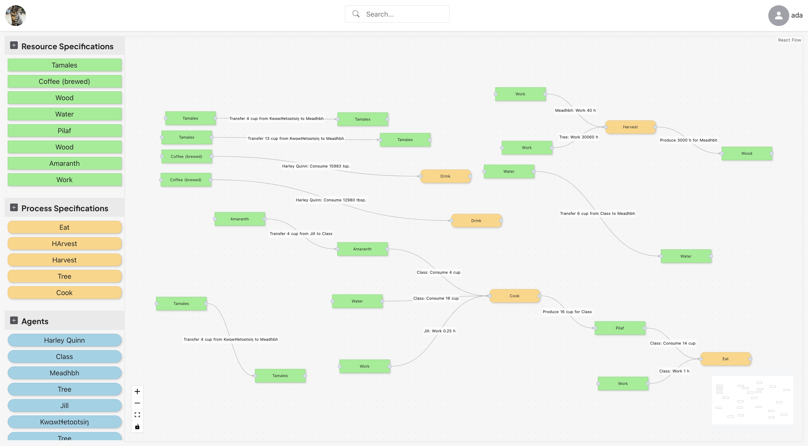

# REA Playspace

The REA Playspace is a graphical interface that lets people play with the concepts behind [Valueflows](https://www.valueflo.ws/).

## Installing
1) Download and install the latest [Holochain Launcher](https://github.com/holochain/launcher/releases/tag/v0.5.1).

2) From the [releases page](https://github.com/lightningrodlabs/rea-playspace/releases/) download the latest `rea-playspace.webhapp` file.

3) Open the Holochain Launcher. Follow the prompts until you get to the main screen with the button 'INSTALL NEW APP' then 'SELECT APP FROM FILESYSTEM'. Select the `rea-playspace.webhapp` file from the previous step.

4) Select 0.0.154 for the Holochain version to install.

   * Advanced: If you want to leave the Network Seed option empty, you can. This will connect you to a network with everyone else who has also left the option empty. If you want to create a playspace with only a few others, enter a Network Seed (any string of characters) and share it with them.
  
5) Click 'Install App'. Find the app in the Installed Apps view. Click open. This will launch it in the browser.

If you are a developer, check out the [Developer docs](./DEVELOP.md).

## User Documentation

User doc for the REA Playspace can be found [here](https://hackmd.io/@valueflows/H1TL7_Xo5).

