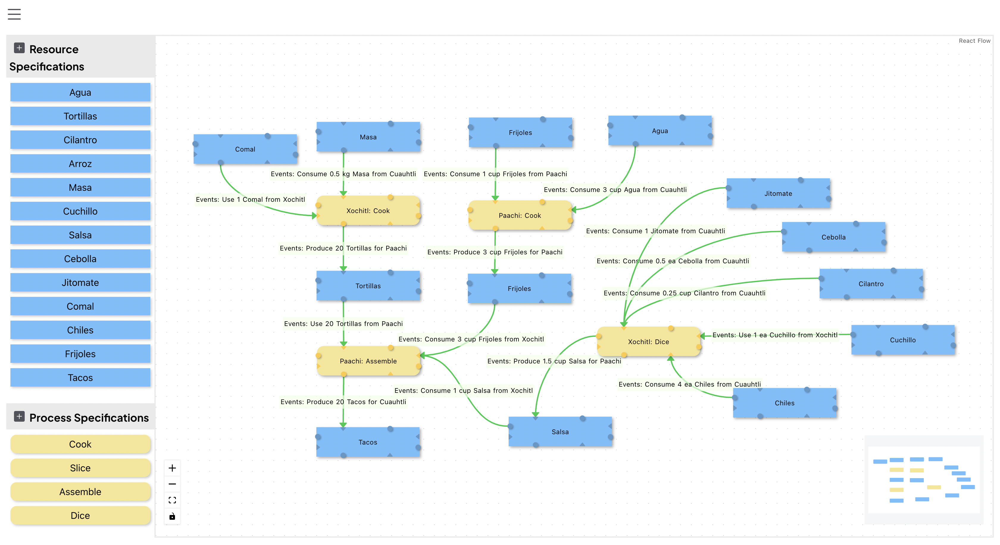

# REA Playspace

The REA Playspace is a graphical interface that lets people play with the concepts behind [Valueflows](https://www.valueflo.ws/).

To speed up ones understanding of the concpepts behind [Valueflows](https://www.valueflo.ws/), below is the same graphical interface with annotations where the final output resource is Tacos.

## Installing

To download the app, please see the instructions for each release on the [Releases Page](https://github.com/lightningrodlabs/rea-playspace/releases). These don't change too much between releases, but the step by step instructions will be provided in each release.

Make sure you are using the [Holochain Launcher](https://github.com/holochain/launcher/releases/) specified in the release notes for the version of REA Playspace you downloaded.

### Notes

Sometimes, when the Holochain version or the zome code used in our app changes, the data you have in the app will no longer be accessible. This is because the network created be Holochain depends on many factors including those versions, the hashes of the integrity zomes, and the network seed.

This is pre-production software. We hope to get to a stable release soon, but please do not rely on this software to work consistently. It is currently moving fast and we are attempting to create a stable UI that works for many possible situations, but still lets people understand the Valueflows data model. It is still low level. It is also a prototyping environment for needed client libraries for developing applications with Valueflows, Holochain, and, eventually, hREA.

## Developers

If you are a developer, check out the [Developer docs](./DEVELOP.md).

## User Documentation

User doc for the REA Playspace can be found [here](https://hackmd.io/@valueflows/H1TL7_Xo5).
